# Car Price Prediction Challenge

Proyecto de Machine Learning para la predicción del precio de venta de vehículos de segunda mano, basado en el dataset público de Kaggle:
[Car Price Prediction Challenge](https://www.kaggle.com/datasets/deepcontractor/car-price-prediction-challenge/data)

---

## Descripción del problema

El objetivo es construir un modelo capaz de estimar el **precio de un vehículo** a partir de sus características técnicas y comerciales. Se trata de un problema de **regresión supervisada** sobre un dataset real de 19.237 vehículos con 18 variables (fabricante, modelo, año de producción, tipo de combustible, volumen del motor, kilometraje, cilindros, tipo de cambio, tracción, puertas, color, airbags, entre otras).

---

## Estructura del proyecto

```
├── analisis_cars.ipynb        # Notebook principal con todo el análisis
├── car_price_prediction.csv   # Dataset original
├── imagenes/                  # Gráficas generadas durante el análisis
└── README.md
```

---

## 1. Exploración inicial del dataset

**`df.head()` / `df.info()` / `df.describe()`**

El dataset presentaba varios problemas de formato desde el inicio: la columna `Doors` almacenaba valores como `04-May` en lugar de `04`, `Mileage` incluía el sufijo `km` como texto, y tanto `Levy` como `Engine volume` estaban tipadas como `str` por contener guiones (`-`) en lugar de nulos.

> Conclusión: antes de cualquier análisis es necesario sanear los tipos de dato. Un dataset "sucio" en tipos produce estadísticos incorrectos y modelos que no aprenden lo que deben.

---

## 2. Limpieza de variables

### Tabla de valores nulos (antes del tratamiento)

| Variable      | Nulos  |
|---------------|--------|
| Levy          | 5.819  |
| Engine volume | 1.931  |
| Resto         | 0      |

- **`Levy`**: los guiones (`-`) se convierten a `NaN` al parsear con `pd.to_numeric`. Se imputan con **0**, asumiendo que la ausencia de tasa equivale a no tenerla.
- **`Engine volume`**: se imputa con la **mediana** (2.0L), ya que los valores están concentrados en torno a ella y la media podría verse afectada por outliers.

> Conclusión: la estrategia de imputación debe adaptarse a la distribución de cada variable. Usar la media en distribuciones asimétricas puede sesgar el modelo.

---

## 3. Detección y tratamiento de outliers

### Boxplots — Primera ronda (variables numéricas)

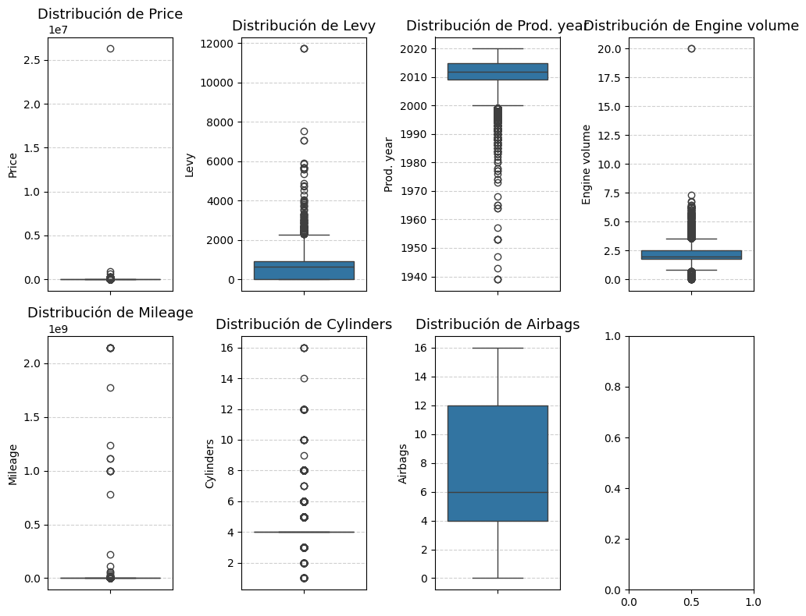

Se generó una cuadrícula de boxplots para todas las variables numéricas (`Price`, `Levy`, `Prod. year`, `Engine volume`, `Mileage`, `Cylinders`, `Airbags`).

> Conclusión: se identificaron outliers severos en `Price`, `Mileage` y `Engine volume` que requerían tratamiento antes de entrenar cualquier modelo.

---

### Tabla: coches con Price > 500.000

| Fabricante    | Modelo         | Precio        | Año  |
|---------------|----------------|---------------|------|
| MERCEDES-BENZ | G 65 AMG 63AMG | 627.220       | 2020 |
| LAMBORGHINI   | Urus           | 872.946       | 2019 |
| **OPEL**      | **Combo**      | **26.307.500**| **1999** |

> Conclusión: el registro del OPEL Combo a 26 millones es claramente un error de entrada de datos. Se elimina de forma selectiva. Se optó por eliminar todos los precios superiores a 100.000 para centrar el modelo en el segmento de segunda mano habitual.

---

### Boxplots — Tras eliminar outliers de precio

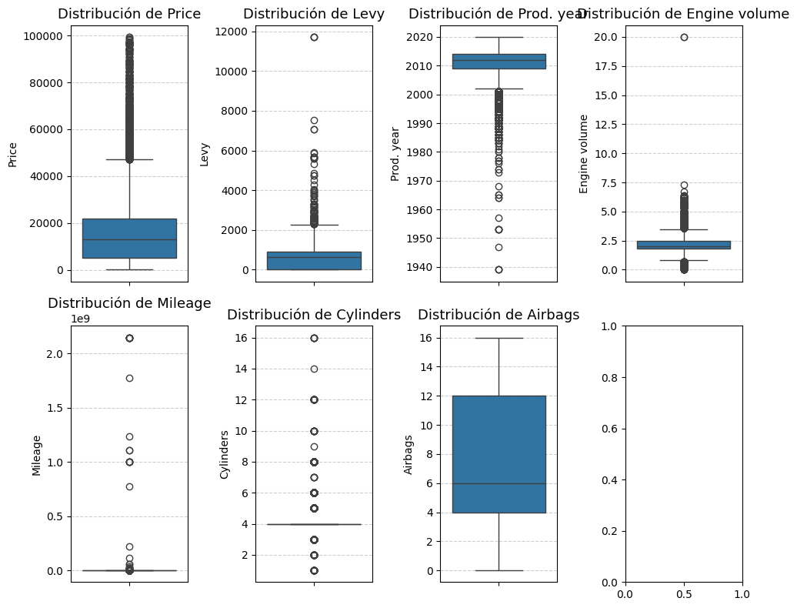

> Conclusión: la distribución de `Price` mejora notablemente. Sin embargo, `Mileage` sigue mostrando valores extremos que requieren tratamiento adicional.

---

### Histograma: fabricantes con coches a precio < 500

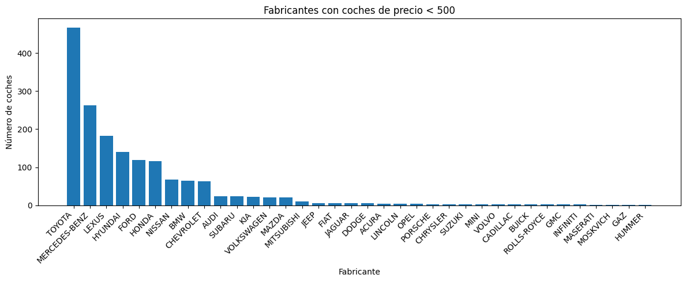

> Conclusión: precios por debajo de 500 son anómalos en el contexto del dataset (errores o registros incompletos). Se eliminan para evitar ruido en la parte baja del rango de precios.

---

### Boxplots — Tras eliminar precio < 500

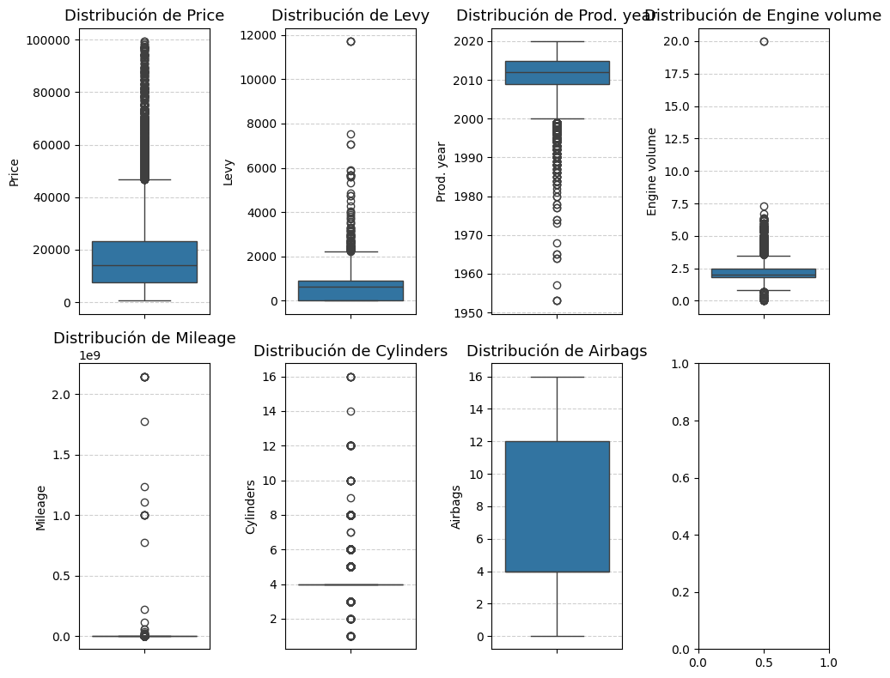

> Conclusión: el rango de precios queda más contenido y representativo del mercado real de segunda mano.

---

### Tabla: top 10 vehículos con mayor kilometraje

| Fabricante    | Modelo   | Mileage       |
|---------------|----------|---------------|
| VOLKSWAGEN    | Golf     | 2.147.484.647 |
| MERCEDES-BENZ | C 180    | 2.147.484.647 |
| SUBARU        | Forester | 2.147.484.647 |
| ...           | ...      | ...           |

> Conclusión: el valor 2.147.484.647 corresponde al límite máximo de un entero de 32 bits (`INT_MAX`), lo que indica un desbordamiento en origen. Estos valores se reemplazan por el percentil 75 (Q3) de la variable.

---

### Boxplots — Tras corregir Engine volume y Mileage

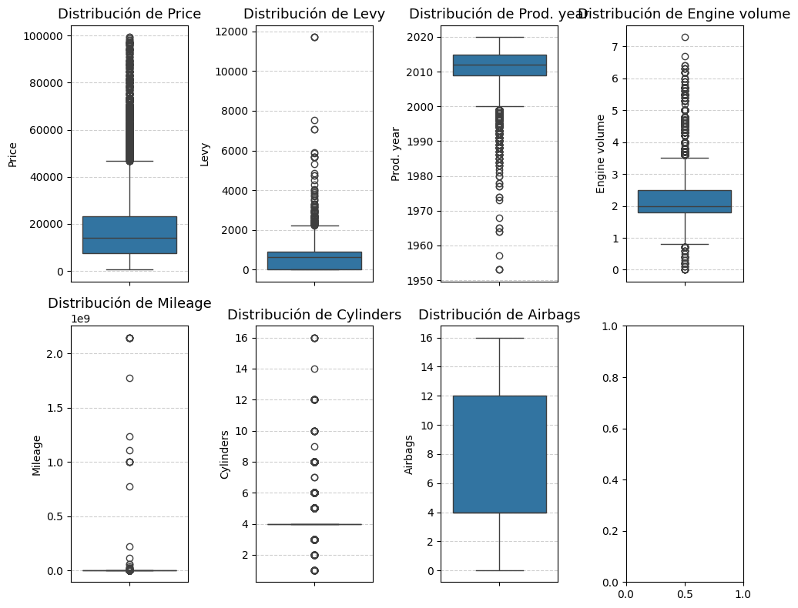

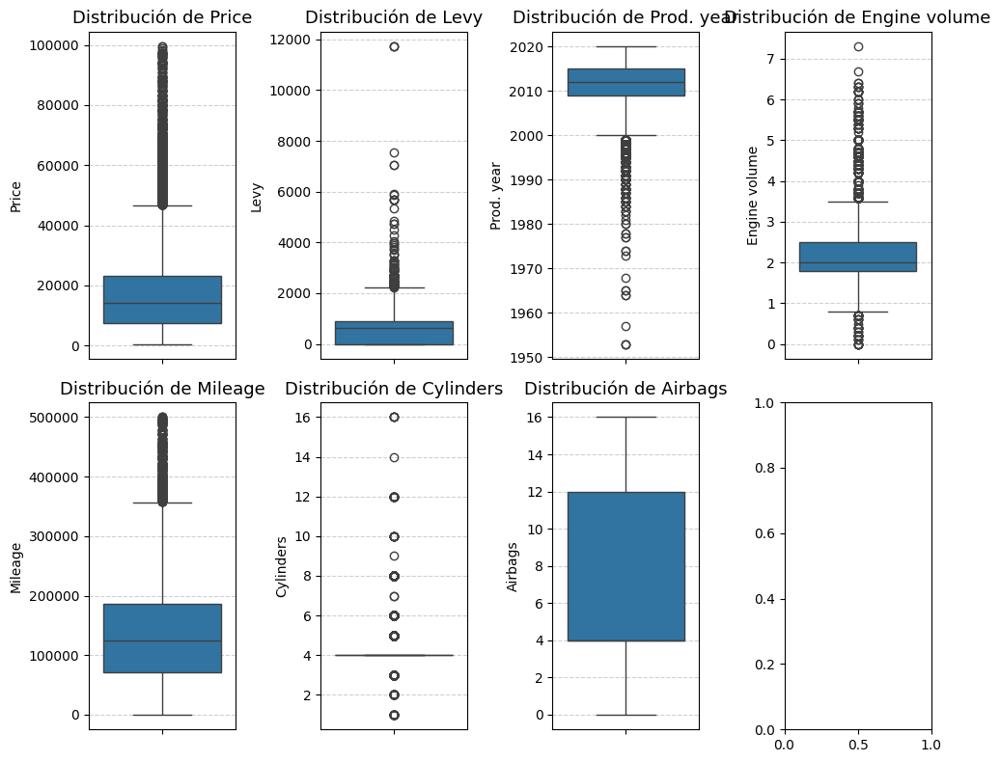

> Conclusión: tras eliminar los registros con `Engine volume > 10L` (desbordamiento físicamente imposible) y sustituir los kilometrajes extremos por Q3, las distribuciones son ya coherentes con el dominio del problema.

---

## 4. Análisis exploratorio (EDA)

### Countplot: distribución de variables categóricas

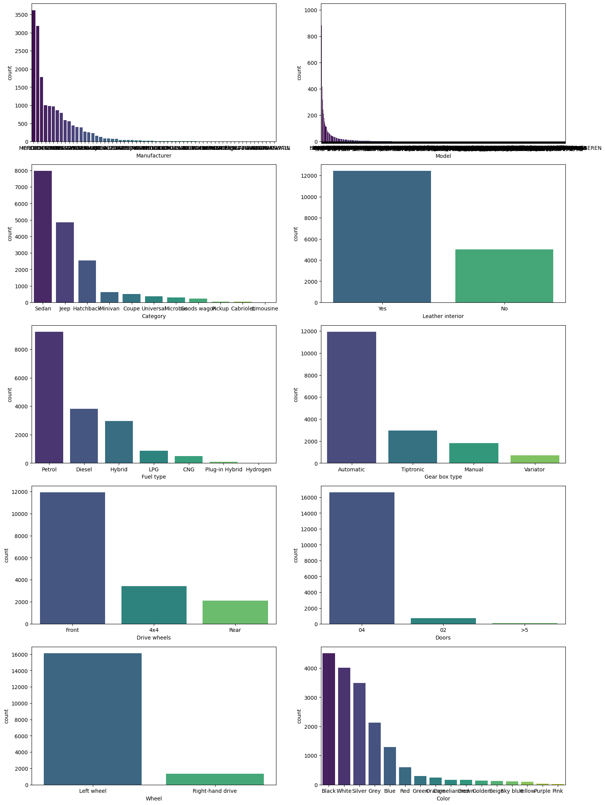

> Conclusión: `Hyundai` y `Toyota` dominan el dataset ampliamente. `Fuel type` muestra una mayoría de coches de gasolina, con categorías minoritarias como eléctricos o híbridos enchufables. `Model` con 1.533 valores únicos se elimina por su alta cardinalidad.

---

### Tabla: fabricantes conservados (> 50 observaciones)

Se eliminan fabricantes con escasa representación (`TESLA`, `FERRARI`, `LANCIA`, `HAVAL`, etc.) y se conservan los **22 fabricantes** con más de 50 registros.

> Conclusión: categorías con muy pocas observaciones no aportan información estadísticamente significativa y pueden causar sobreajuste en la codificación.

---

### Boxplot: Price por cada variable categórica

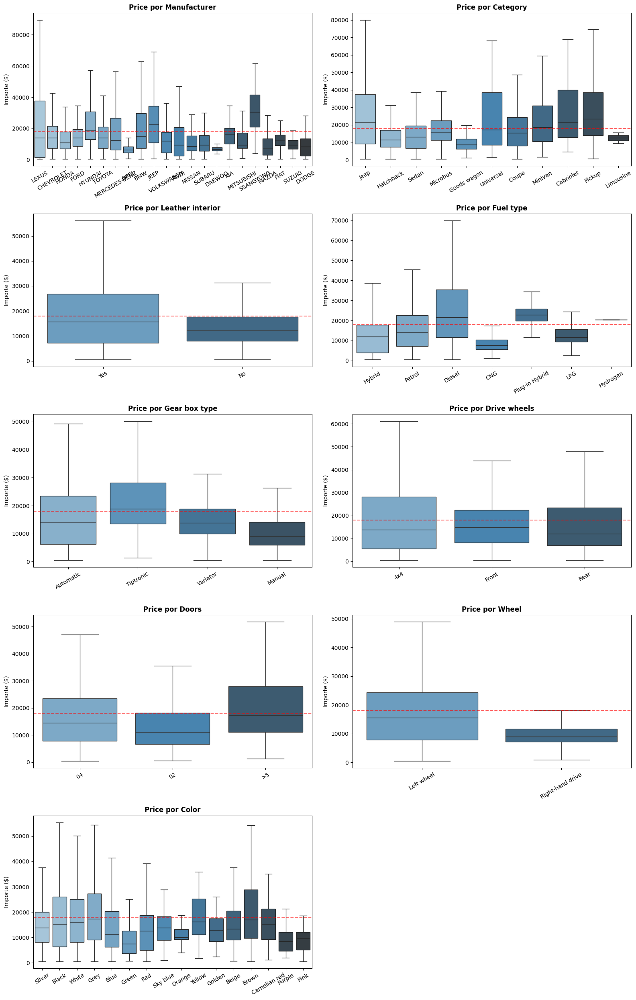

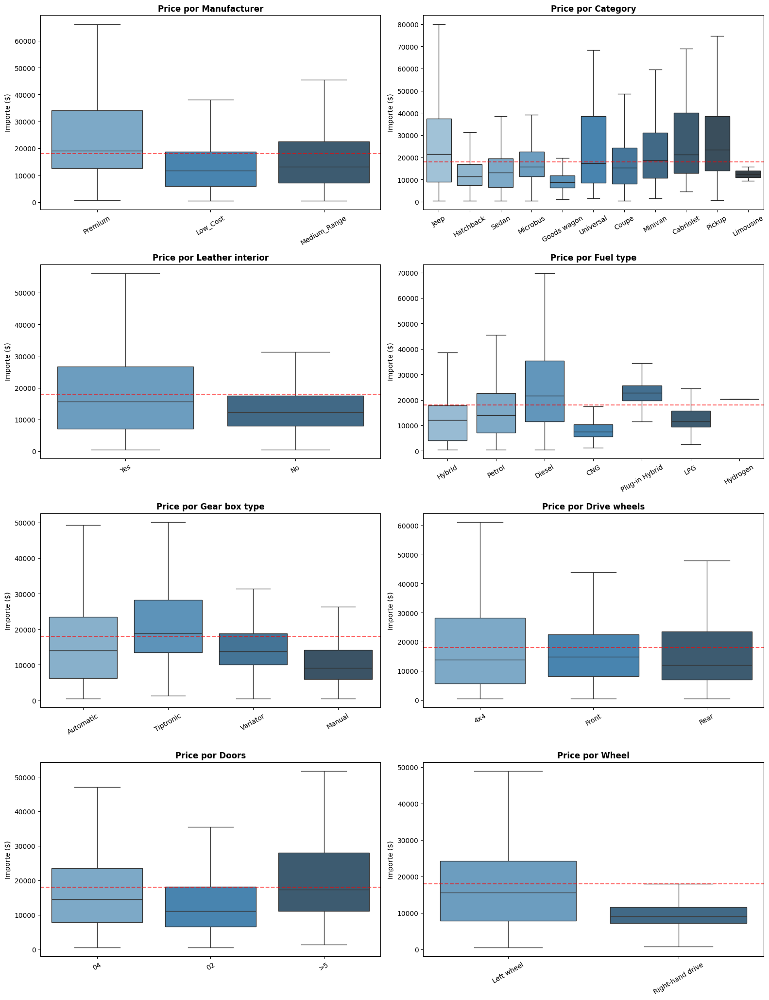

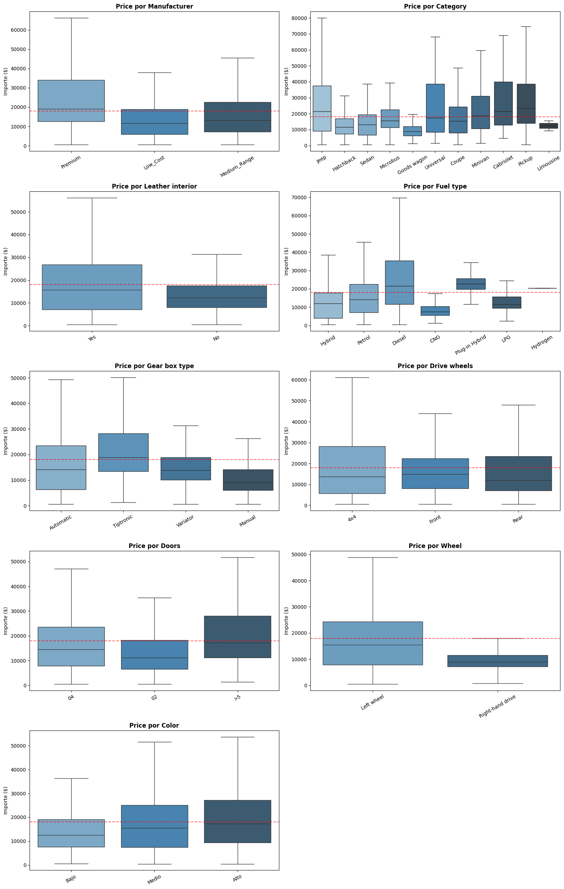

> Conclusión: variables como `Category` (las limousines destacan claramente sobre el resto), `Gear box type` y `Fuel type` muestran diferencias notables en la distribución de precios, anticipando que serán variables relevantes para el modelo.

---

### Encoding de Color y Manufacturer

Ambas variables se transformaron mediante **target encoding + qcut** en 3 grupos ordenados por precio medio:

- **Color**: `Bajo` / `Medio` / `Alto`
- **Manufacturer**: `Low_Cost` (~13.965) / `Medium_Range` (~17.934) / `Premium` (~23.671)

> Conclusión: agrupar por precio medio reduce la dimensionalidad y aporta información ordinal al modelo, siendo más informativo que una codificación one-hot de 22 categorías.

---

### Heatmap de correlaciones — Primera versión

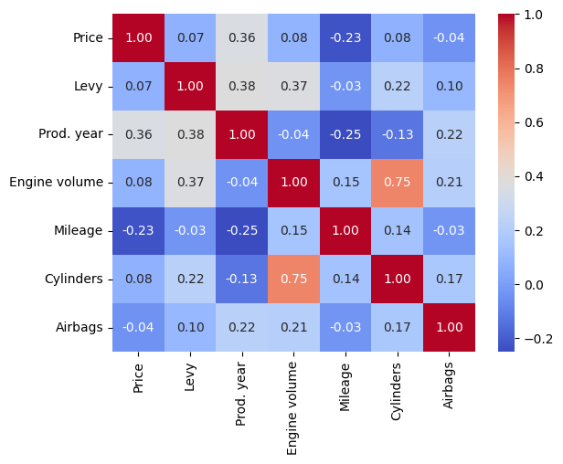

> Conclusión: `Cylinders` y `Engine volume` presentan alta correlación entre sí. Respecto a `Price`, ambas tienen una correlación modesta (~0.08). Se decide eliminar `Engine volume` para evitar multicolinealidad.

---

### Heatmap de correlaciones — Segunda versión (sin Engine volume)

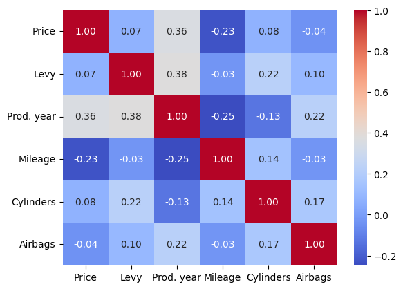

> Conclusión: `Prod. year` es la variable numérica con mayor correlación con `Price`. Los coches más nuevos tienden a valer más, lo que es coherente con el mercado real.

---

## 5. Preparación para modelado

- **Train/Test split**: 70% entrenamiento / 30% test (`random_state=45`)
- **Escalado**: `StandardScaler` sobre variables numéricas (`Levy`, `Prod. year`, `Mileage`, `Cylinders`, `Airbags`)
- **Codificación**: `pd.get_dummies` con `drop_first=True` para variables categóricas
- **Alineación**: `X_train.align(X_test)` para garantizar las mismas columnas en ambos conjuntos

---

## 6. Modelos entrenados y resultados

### Regresión Lineal

| Métrica | Valor     |
|---------|-----------|
| MAE     | 8.580,66  |
| RMSE    | 12.195,94 |
| R²      | 0.3555    |

**Tabla de coeficientes (top variables)**:

| Variable                  | Coeficiente |
|---------------------------|-------------|
| Category_Limousine        | +9.322      |
| Gear box type_Tiptronic   | +8.863      |
| Prod. year                | +7.264      |
| Fuel type_Plug-in Hybrid  | +6.627      |

> Conclusión: la regresión lineal solo explica el 35% de la varianza. Los coeficientes son interpretables (una limousine sube el precio estimado en ~9.300 unidades; un año más de antigüedad suma ~7.264), pero el modelo es demasiado simple para capturar las relaciones no lineales del mercado de coches.

---

### Scatter: Real vs Predicho — Regresión Lineal

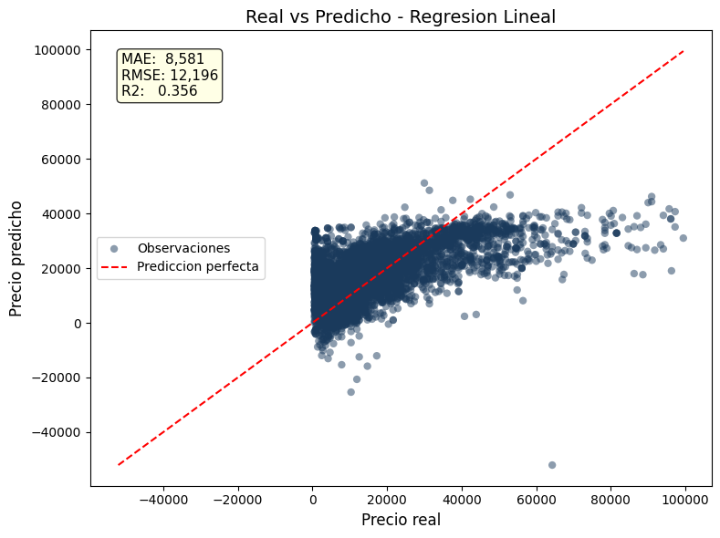

> Conclusión: el modelo sobrestima el precio de los coches baratos e infraestima el de los caros. La nube de puntos no sigue bien la diagonal roja, confirmando que la relación entre variables y precio no es lineal.

---

### Histograma de residuos — Regresión Lineal

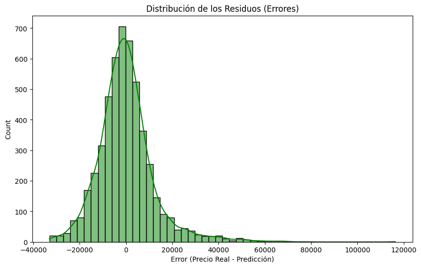

> Conclusión: los residuos están aproximadamente centrados en 0 pero con colas largas, lo que indica que el modelo comete errores grandes en algunos casos concretos.

---

### Árbol de Decisión (`max_depth=5`)

| Métrica | Valor    |
|---------|----------|
| MAE     | 7.743,67 |
| R²      | 0.4361   |

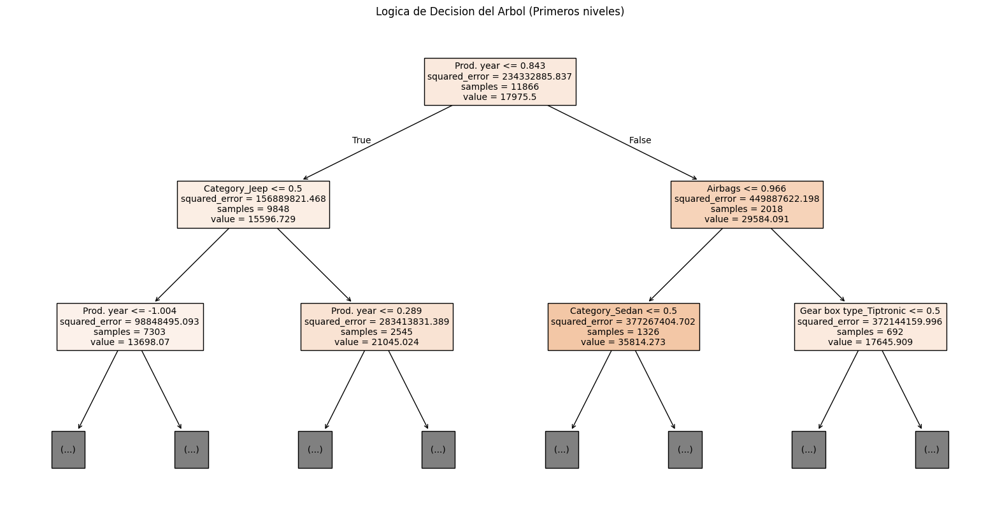

> Conclusión: el árbol mejora ligeramente la regresión lineal y permite entender la lógica de decisión visualmente. `Prod. year` aparece como el primer nodo de división, confirmando que el año de fabricación es la variable más determinante.

---

### Random Forest (`n_estimators=100`)

| Métrica | Valor    |
|---------|----------|
| MAE     | 4.082,02 |
| RMSE    | 7.305,16 |
| R²      | 0.7688   |

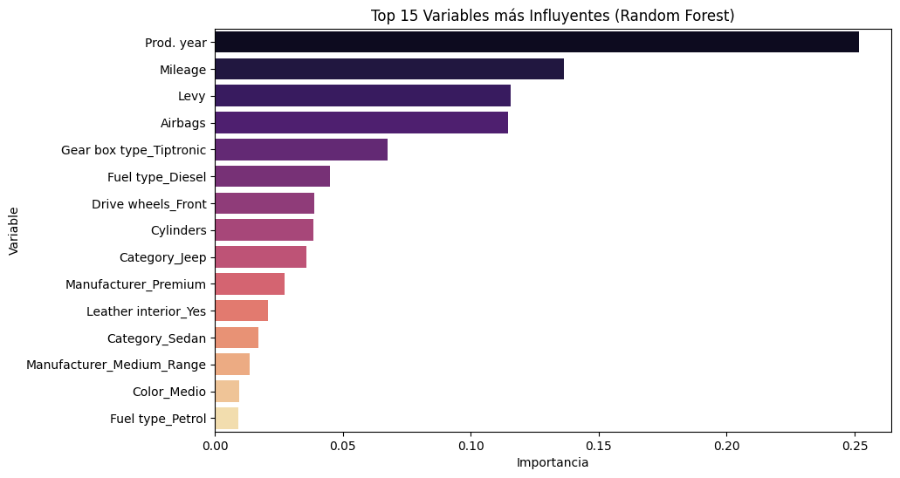

> Conclusión: `Prod. year`, `Mileage` y `Levy` son las variables más influyentes. Random Forest supone un salto cualitativo, capturando el 77% de la varianza, aunque pierde la interpretabilidad directa de la regresión lineal.

---

### Scatter: Real vs Predicho — Random Forest

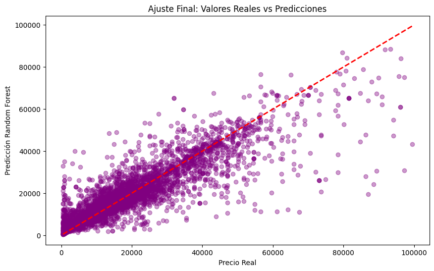

> Conclusión: los puntos siguen mucho mejor la diagonal roja que en la regresión lineal. Persiste cierta dispersión en los rangos de precio alto.

---

### KDE: distribución de errores — Lineal vs XGBoost

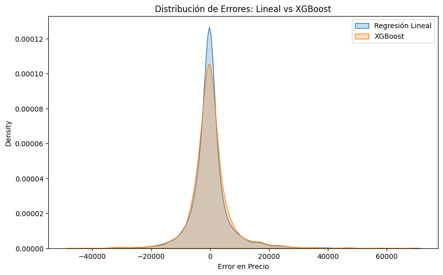

> Conclusión: ambas curvas están centradas en 0, pero XGBoost presenta colas más ligeras, lo que indica que comete menos errores extremos que la regresión lineal.

---

### XGBoost — Importancia de variables (Gain)

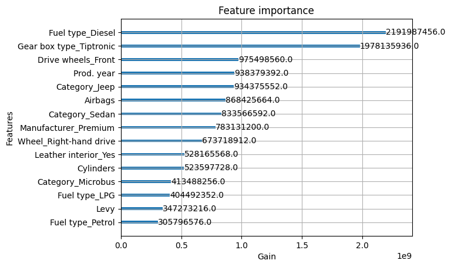

> Conclusión: XGBoost coincide con Random Forest en señalar `Prod. year` y `Mileage` como las variables de mayor ganancia, validando la consistencia de ambos modelos.

---

### XGBoost base — Scatter Real vs Predicho

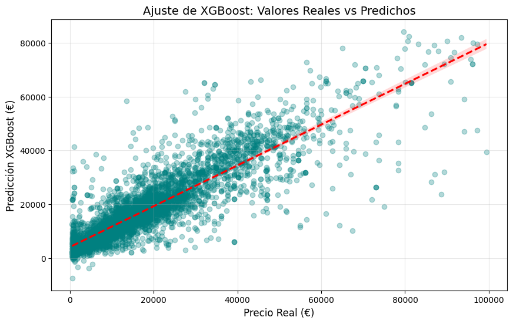

| Métrica | Valor    |
|---------|----------|
| MAE     | 4.417,87 |
| RMSE    | 7.423,21 |
| R²      | 0.7612   |

> Conclusión: XGBoost en su configuración inicial obtiene resultados similares a Random Forest. La línea de regresión sigue bien la diagonal, aunque con algo más de dispersión en precios altos.

---

### XGBoost optimizado (GridSearchCV) — Scatter Real vs Predicho

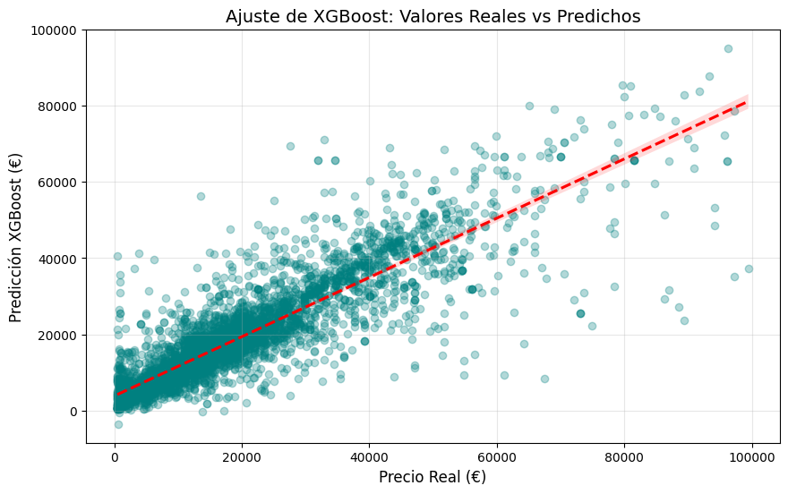

| Métrica | Valor    |
|---------|----------|
| MAE     | 4.070,90 |
| R²      | 0.7712   |

> Conclusión: la optimización de hiperparámetros (`learning_rate`, `max_depth`, `n_estimators`, `subsample`) mejora el XGBoost hasta superar a Random Forest. La mayor ganancia, sin embargo, se produce al pasar de modelos lineales a ensemble methods, no en el ajuste fino de hiperparámetros.

---

## 7. Segmentación de mercado — K-Means Clustering

Además de los modelos supervisados, se aplicó **K-Means** como técnica de aprendizaje no supervisado para segmentar los vehículos en grupos naturales según sus características numéricas (`Price`, `Mileage`, `Prod. year`, `Cylinders`, `Airbags`, `Levy`).

### Scatter: segmentación Mileage vs Prod. year


> Conclusión: se identifican 4 grupos bien diferenciados. Los vehículos más nuevos y con menos kilometraje se agrupan de forma natural, lo que confirma que estas dos variables son las más discriminantes para segmentar el mercado.

---

### Scatter — Versiones adicionales de segmentación

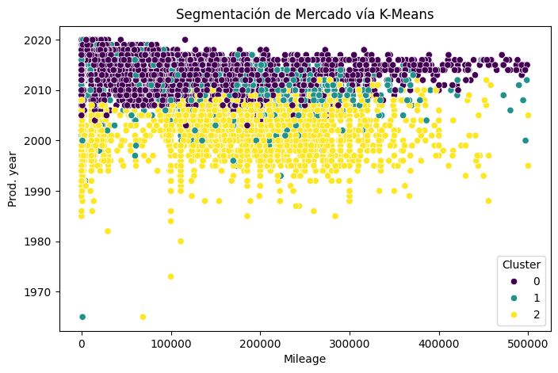

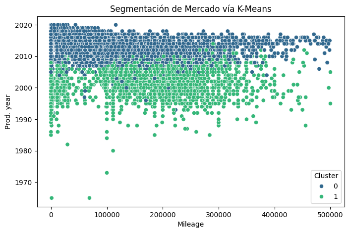

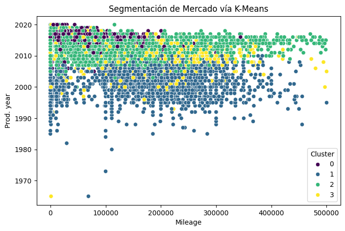

> Conclusión: las distintas representaciones de los clusters muestran consistencia en la segmentación. Los grupos se mantienen estables independientemente de las variables representadas en los ejes.

---

### Boxplot: distribución de precio por cluster

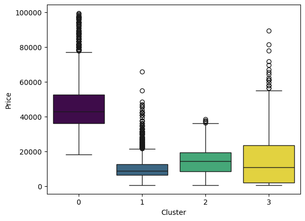

**Precio medio por cluster (4 grupos)**:

| Cluster | Precio medio |
|---------|-------------|
| 0       | 46.447      |
| 1       | 10.461      |
| 2       | 14.026      |
| 3       | 14.770      |

> Conclusión: el cluster 0 corresponde claramente a vehículos de **gama alta** (precio medio ~46.000), mientras que los clusters 1, 2 y 3 agrupan el segmento de segunda mano más asequible. La segmentación es coherente con la lógica del mercado.

---

### KDE: distribución de precio por cluster

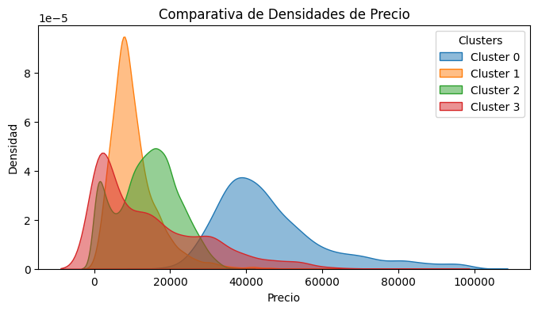

> Conclusión: las curvas de densidad confirman que el cluster 0 tiene una distribución de precios desplazada claramente hacia la derecha respecto al resto. Los clusters 1, 2 y 3 se solapan en el rango de precios bajos, lo que indica que se diferencian principalmente por otras variables como el año o el kilometraje.

---

## 8. Red Neuronal (TensorFlow / Keras)

Se entrenó una red neuronal densa con capas `Dense` y `Dropout` como modelo adicional de comparación.

### Curva de aprendizaje — Pérdida durante el entrenamiento

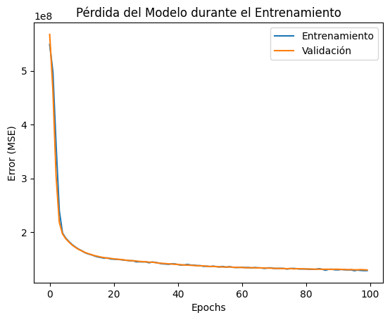

> Conclusión: las curvas de entrenamiento y validación convergen correctamente, sin señales de overfitting. Al inicio, el error de validación aparece por debajo del de entrenamiento debido al efecto del **Dropout** (durante el entrenamiento se apagan neuronas aleatoriamente, mientras que en validación todas están activas). A medida que avanzan las épocas, ambas curvas se estabilizan y convergen.

---

### Scatter: Real vs Predicho — Red Neuronal

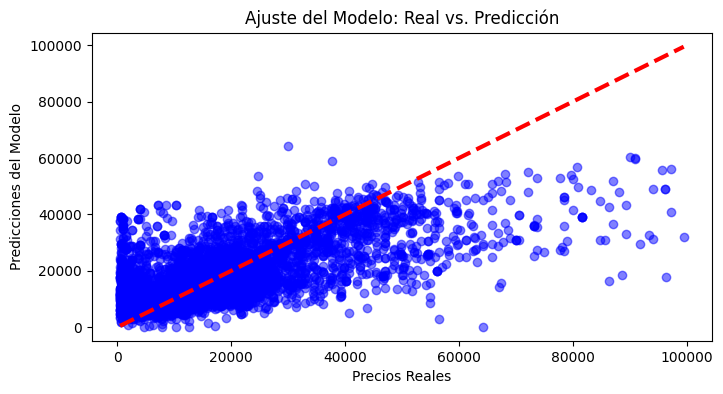

| Métrica | Valor     |
|---------|-----------|
| MAE     | 7.692,26  |
| RMSE    | 11.386,79 |
| R²      | 0.4382    |

> Conclusión: la red neuronal mejora ligeramente a la regresión lineal y al árbol de decisión, pero queda muy por detrás de Random Forest y XGBoost. Los puntos se distribuyen en torno a la diagonal roja pero con dispersión considerable en los rangos de precio alto, donde el modelo tiende a infraestimar.

---

## 9. Comparativa final de todos los modelos

| Modelo                   | MAE          | RMSE      | R²         |
|--------------------------|--------------|-----------|------------|
| Regresión Lineal         | 8.580,66     | 12.195,94 | 0.3555     |
| Árbol de Decisión        | 7.743,67     | —         | 0.4361     |
| Red Neuronal             | 7.692,26     | 11.386,79 | 0.4382     |
| XGBoost (base)           | 4.417,87     | 7.423,21  | 0.7612     |
| Random Forest            | 4.082,02     | 7.305,16  | 0.7688     |
| **XGBoost (optimizado)** | **4.070,90** | —         | **0.7712** |

> **Conclusión general**: el modelo ganador es **XGBoost optimizado**, seguido muy de cerca por **Random Forest**. Ambos reducen el error a la mitad respecto al resto y explican el 77% de la varianza del precio. La red neuronal, pese a su mayor complejidad, no supera a los ensemble methods en este problema tabular. La variable más determinante en todos los modelos es el **año de producción**, seguida del **kilometraje**: los coches más nuevos y menos usados valen más, lo que es coherente con el comportamiento real del mercado de segunda mano.

---

## Tecnologías utilizadas

- Python 3.13
- pandas, numpy
- matplotlib, seaborn
- scikit-learn (LinearRegression, DecisionTreeRegressor, RandomForestRegressor, StandardScaler, GridSearchCV, KMeans)
- xgboost
- tensorflow / keras

---

## Autor

Proyecto desarrollado como práctica de análisis de datos y Machine Learning sobre un dataset real de Kaggle.
